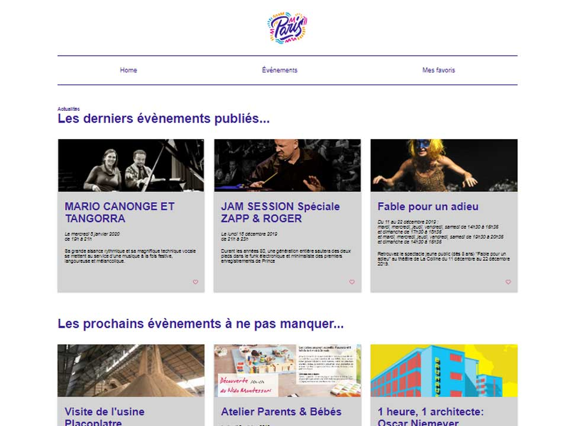
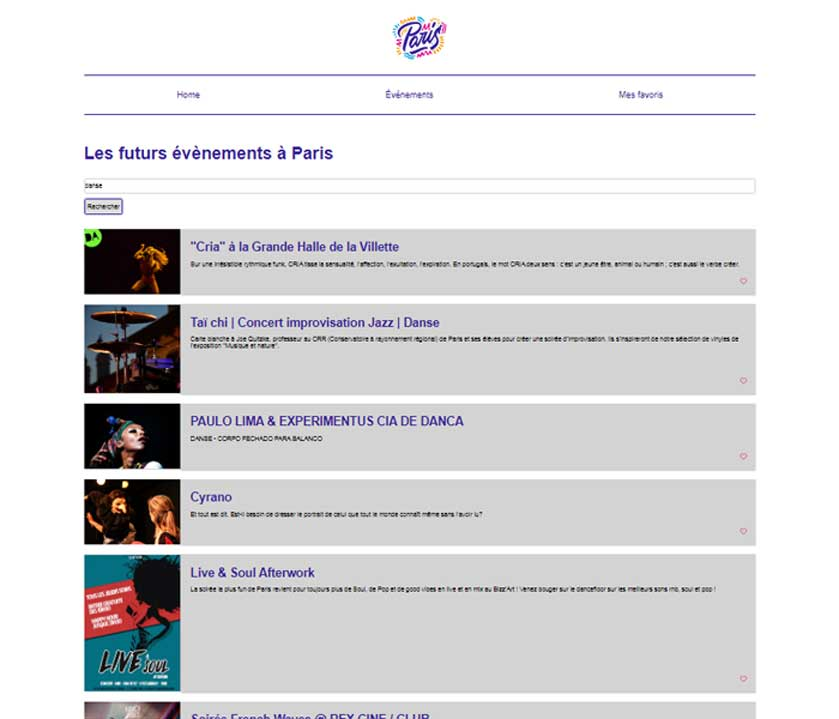
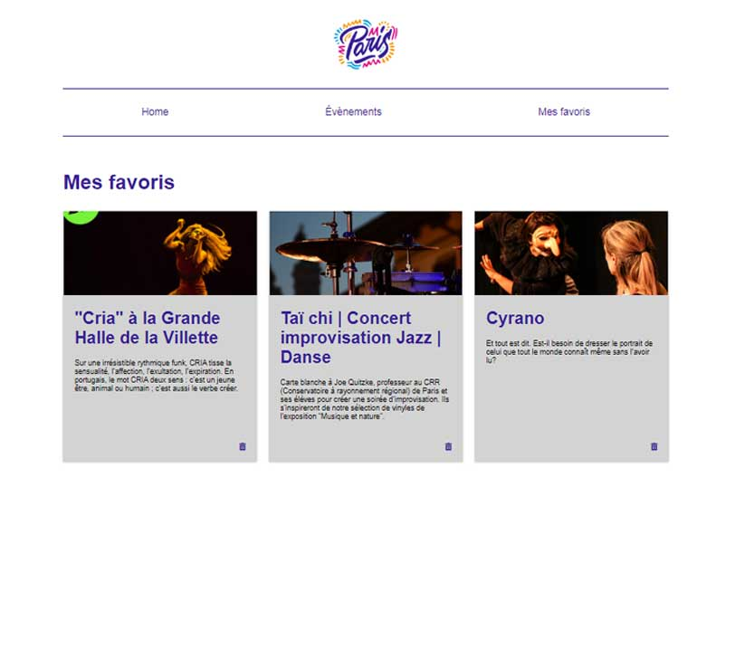

<h1># ParisEvents</h1>

<h2>Bienvenue sur Paris Events !</h2>

Ce projet a été réalisé en cours de formation à l'Ecole Multimédia ce mois de novembre 2019. 
Il utilise les données de <a href="https://opendata.paris.fr/pages/home/" target="blank">l'API Open Data Paris</a>.

C'est donc un projet d'approfondissement du Javascript.

<h2>Languages utilisés</h2>

Entièrement réalisé from scratch, il utilise les languages suivants :

<ul>
  <li>HTML</li>
  <li>CSS</li>
  <li>jQuery</li>
</ul>

<h2>Responsive</h2>

Il est responsive. :)

<h2>Screenshots</h2>

